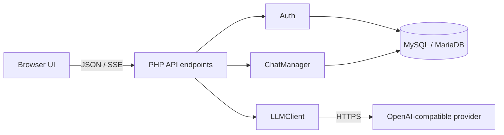

# PHP ChatGPT

PHP ChatGPT is a lightweight, self-hosted web chat application for PHP shared-hosting environments. It gives each registered user a private chat workspace and lets that user connect their own OpenAI-compatible LLM endpoint and API key.

The project is intended for platforms that provide PHP, MySQL or MariaDB, cURL, and Apache-compatible hosting, including shared hosting control panels. It does not bundle a provider API key or database credentials.

## What It Does

- Registers users, signs them in, and maintains server-side sessions.
- Lets each user save an OpenAI-compatible endpoint, model, and API key.
- Encrypts saved API keys before storing them in the database.
- Creates, updates, archives, lists, and deletes user-owned conversations.
- Stores message history and builds conversation context for LLM requests.
- Sends regular JSON chat responses or streams tokens to the browser with Server-Sent Events (SSE).
- Supports image attachments for compatible vision-capable providers.
- Renders Markdown and syntax-highlighted code in the browser.

## Platform And Requirements

| Component | Requirement |
| --- | --- |
| Web server | Apache-compatible server with PHP enabled |
| PHP | PHP 8.0+ with PDO MySQL, OpenSSL, cURL, and mbstring |
| Database | MySQL 5.7+ or MariaDB 10.4+ using InnoDB |
| Browser | Modern browser with Fetch API and EventSource support |
| LLM provider | An OpenAI-compatible chat-completions endpoint; SenseNova has a supported payload adaptation |

## Quick Start

1. Create an empty MySQL or MariaDB database and a database user with access only to that database.
2. Import [config/schema.sql](config/schema.sql) using phpMyAdmin, a database client, or the MySQL command line.
3. Update [config/config.php](config/config.php) with the database host, database name, database username, database password, `SITE_URL`, and a newly generated encryption key.
4. Generate a unique encryption key with `openssl rand -hex 32` and set it as `ENCRYPTION_KEY`. Keep this value private and stable after users have saved API keys.
5. Ensure the web server can write to `uploads/` and that PHP upload limits accommodate the desired image size.
6. Deploy the directory to the web root, then open the site URL and register an account.
7. Open API Settings in the application and save an endpoint URL, provider API key, and preferred model.

For a subdirectory deployment, set `SITE_URL` to the complete public URL, including its path, for example `https://example.com/chat`.

## Architecture And Request Flow



1. The browser sends credential, conversation, or message requests to the PHP API routes.
2. Each protected route creates `Auth`, checks the session, and resolves the authenticated user.
3. Conversation queries always include both the conversation ID and the authenticated user ID.
4. `Auth` decrypts only the current user's saved LLM credential immediately before use.
5. `ChatManager` builds provider messages from the system prompt, stored history, and the new user message.
6. `LLMClient` calls the user-selected provider. Streaming requests relay provider chunks through SSE and append them to the assistant message in the database.

## Project Structure

```text
.
|- index.php                 Browser application shell and configuration handoff
|- api/
|  |- auth.php               Registration, login, logout, and LLM settings API
|  |- chat.php               Chat completion, streaming, and image-upload API
|  `- conversations.php      Conversation CRUD API
|- config/
|  |- config.php             Deployment-specific application configuration
|  |- init.php               Session initialization, PDO factory, JSON helpers
|  `- schema.sql             MySQL/MariaDB database schema
|- includes/
|  |- Auth.php               Authentication and encrypted API-key management
|  |- ChatManager.php        Conversation and message persistence
|  `- LLMClient.php          OpenAI-compatible LLM and SSE client
|- assets/
|  |- css/                   Application and syntax-highlight styles
|  |- js/                    Browser UI, Markdown, and highlighting logic
|  `- img/                   Static image assets
`- uploads/                  Runtime image storage; contents are Git-ignored
```

## Database Design

The complete DDL is in [config/schema.sql](config/schema.sql). The normalized core tables are:

| Table | Purpose | Relationships |
| --- | --- | --- |
| `users` | Account identity, profile metadata, password hash, and timestamps | Owns conversations and API-key settings |
| `conversations` | Chat title, system prompt, selected model, archive status | Belongs to one user; owns messages |
| `messages` | Ordered user, assistant, and system content plus optional image URL and token count | Belongs to one conversation |
| `user_api_keys` | User endpoint, selected model, and encrypted provider API key | One active record per user |

Foreign keys use `ON DELETE CASCADE`, so deleting a user removes that user's conversations, messages, and stored provider credentials. Indexes support account lookup, user conversation listing, and ordered message retrieval.

## API Routes

| Route | Methods | Purpose |
| --- | --- | --- |
| `api/auth.php?action=register` | POST | Create an account and start a session |
| `api/auth.php?action=login` | POST | Authenticate using username or email |
| `api/auth.php?action=logout` | GET/POST | End the current session |
| `api/auth.php?action=me` | GET | Get the current user |
| `api/auth.php?action=apikey` | GET/POST/PUT/DELETE | Read non-secret LLM settings, save, or remove the user's key |
| `api/conversations.php` | GET/POST | List or create conversations |
| `api/conversations.php?id={id}` | GET/PUT/DELETE | Read, edit, or delete one owned conversation |
| `api/chat.php?conv_id={id}` | POST | Send a non-streaming message |
| `api/chat.php?conv_id={id}&stream=1` | POST | Send a streaming SSE message |

## Security Model

- **Passwords:** password hashes are created with bcrypt through PHP's `password_hash`; plaintext passwords are not stored.
- **Database access:** PDO uses prepared statements with native prepared statements enabled, reducing SQL-injection exposure.
- **Session handling:** cookies are HTTP-only, use `SameSite=Lax`, and the session ID is regenerated after login or registration.
- **Authorization:** authenticated routes require a session, and conversation reads, writes, and deletes are scoped to the owning user ID.
- **Provider keys:** user API keys are encrypted at rest with AES-256-GCM. The encryption key belongs only in deployment configuration and must never be committed.
- **Error handling:** LLM diagnostics redact Bearer tokens and common API-key fields before error logging or response details.
- **Uploads:** the application accepts only JPEG, PNG, GIF, and WebP data URLs. Keep `uploads/` writable by PHP but do not commit uploaded user data.

### Deployment Hardening

Before exposing a deployment publicly, enable HTTPS, restrict database permissions to the application database, set `session.cookie_secure=1` for HTTPS, back up the database, and set appropriate PHP upload and request limits. Add CSRF protection, endpoint allow-listing, image-content validation, rate limiting, and a Content Security Policy before operating the service in a hostile or multi-tenant environment.

## Repository Safety

This repository intentionally excludes user uploads, local environment files, logs, editor metadata, and local configuration overrides. Before publishing any future change, verify that it does not include:

- Database credentials, encryption keys, or provider API keys.
- User-uploaded files, chat exports, or database dumps.
- Production URLs, server paths, request IDs, or unredacted logs.

Use GitHub secret scanning and push protection on the remote repository as an additional safeguard.

## License

No license has been selected. Add an explicit license before distributing or accepting external contributions.